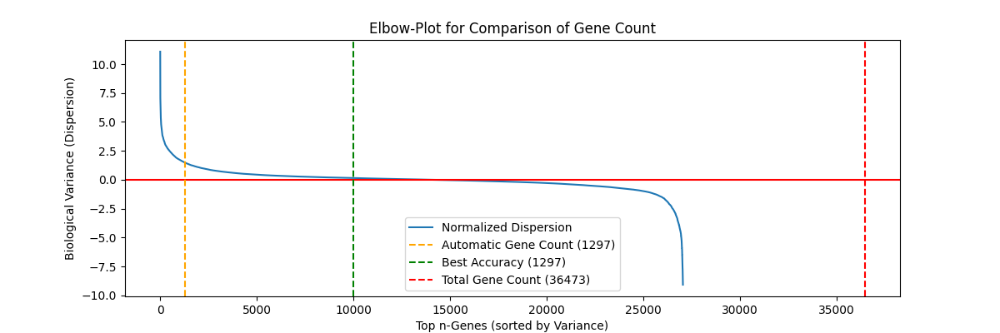

# Presentation 5 am 8.6.26

## Code Improvements

- Split nach donor gemacht (siehe check_dataset.ipynb)
- Genfiltering

- Bayes search mit custom stopper

## Results

- Ergebnisse HPC

| Modell | Iterationen | Laufzeit | Zeit/Iteration | Bester Score | Beste Parameter |
|---|---|---|---|---|---|
| **Logistic Regression** | 10 | 11h26m | 1h9m | 0.8970 | `C=0.3520, class_weight=None, penalty=l1, tol=0.008815` |
| **Random Forest** | 19 | 1h1m | 3m | 0.8197 | `max_depth=30, max_features=sqrt, n_estimators=100` |
| **XGBoost** | 10 | 6h32m | 39m | 0.9240 | `colsample_bytree=0.3244, learning_rate=0.1728, max_depth=5` |

- Ergebnisse robustness tests

| Modell | Test Accuracy | Random Dropout | Multiple Executions | Feature Importance Dropout | Out of Distribution Accuracy |
|---|---|---|---|---|---|
| **Logistic Regression** | 0.9011 | 0.8803 | No Inconsistent Predictions | 5%: 0.4316 10%: 0.3699 15%: 0.4173 20%: 0.3631 25%: 0.3266 30%: 0.2988 | 0.1638 |
| **Random Forest** | 0.7474 | 0.7462 | No Inconsistent Predictions | 5%: 0.3461 10%: 0.0431 15%: 0.0145 20%: 0.0119 25%: 0.0118 30%: 0.0117 | 0.1136 |

## New Dataset

- HumanCellAtlas

## Weiteres Vorgehen

- Klassen mit wenigen Trainingsdaten herausfiltern
- Weiteren Datensatz analysieren
- Decoupler testen
- Robustness Tests mit out of distribution tests erweitern
- Ensemble Modelle / Ansätze für robustere Modelle trainieren

## Fragen

- Was soll mit Klassen mit sehr wenigen Trainingsdaten gemacht werden?

- Python package mit gridsearch, train und predict (wahrscheinlich in einem eigenen Repo)
- nach gridsearch und train wird reported auf hold out datensatz, gridsearch wechselt dann in train
- hold out split wird von mir gesetzt bei gridsearch(user gibt nur prozentteil an; wird dann an train weitergegeben), bei train kann user selber hold out datensatz angeben
- Comparison mit Celltypist -> schauen wie man es trainieren kann
- nur wenige Gene aus Feature Imporance löschen (0,1 0,5 1 2%)
- Ensemble Modell auch mit denselben Modellen auf jeweils unterschiedlichen Daten trainiert (also über Feature Importance Dropout werden Features gelöscht) (evtl hierbei testen ob ein Stacking/Voting Classifier oder ein regelbasiertes matching auf das Modell mit den meisten übereinstimmenden Features besser ist). Trotzdem auch ein normales Ensemble Modell testen und dann vergleichen
- Vor den Ensemble Modellen nochmal recherchieren ob es noch weitere relevante Modelle gibt und dann entscheiden welche Modelle in das Ensemble aufgenommen werden

## Entscheidung für min_genes

### Score bei optimaler LR mit jeweils train und test mit min_genes
Ohne: 0.9011296395911781, Macro F1: 0.504096164631464
20: 0.90224186247036, Macro F1: 0.5744418750743242
100: 0.9091800065338125, Macro F1: 0.7760799430608922
150: 0.9174180778535298, Macro F1: 0.8617811577208385
200: 0.9174180778535298, Macro F1: 0.8484774676167686

### Score bei optimaler LR mit jeweils train mit min_genes, test fest auf min_genes=200
Ohne: 0.915858687172629
20: 0.9167502507522568
100: 0.9175303688844311
150: 0.9176418143318845
200: 0.917753259779338
NEU
Ohne: 0.9164284143391247, Macro F1: 0.7122163277778566
20: 0.916318451726413, Macro F1: 0.7929844825760659
100: 0.916648339564548, Macro F1: 0.7950758496854666
150: 0.9176380030789532, Macro F1: 0.8508946077305661
200: 0.9174180778535298, Macro F1: 0.8484774676167686

### Score bei optimaler LR mit jeweils train mit min_genes, test fest auf min_genes=20
Ohne: 0.90224186247036, Macro F1: 0.5811079720161112
20: 0.9029963354171158, Macro F1: 0.5840748885803906
100: 0.9004095710282388, Macro F1: 0.5182459015849566
150: 0.9001940073291658, Macro F1: 0.4826242326190024
200: 0.8872601853847812, Macro F1: 0.3724735797384595

=> min_samples=150

## Entscheidung für min_samples with scumi annotated labels (min_samples auf alten Labels)

### Score bei optimaler LR mit jeweils train und test mit min_samples
Ohne: 27620 Samples, 0.9469607315761162, Macro F1: 0.9342823501005492, Trainingszeit: 4m
20: 27560 Samples, 0.9470791118775598, Macro F1: 0.9283774859041692, Trainingszeit: 4m
100: 27168 Samples, 0.9503430251551781, Macro F1: 0.9651265111037655, Trainingszeit: 3m37s
150: 26850 Samples, 0.9487574224763581, Macro F1: 0.9572966777914522, Trainingszeit: 3m19s
200: 26322 Samples, 0.9495152123035774, Macro F1: 0.9375371081102105, Trainingszeit: 2m46s

### Score bei optimaler LR mit jeweils train mit min_genes, test fest auf min_genes=200
Ohne: 27620 Samples, 0.9482893123815892, Macro F1: 0.9386498875090699, Trainingszeit: 4m
20: 27560 Samples, 0.9495152123035774, Macro F1: 0.9396189606405038, Trainingszeit: 4m
100: 27168 Samples, 0.9505182213306587, Macro F1: 0.9408314789887745, Trainingszeit: 3m33s
150: 26850 Samples, 0.9481778669341357, Macro F1: 0.9369782452286406, Trainingszeit: 3m19s
200: 26322 Samples, 0.9495152123035774, Macro F1: 0.9375371081102105, Trainingszeit: 2m46s

## Entscheidung ob zusätzlich Standardscaler
### LR ohne Standardscaler
0.9173081152408181
Macro F1: 0.8603947961498007

### LR mit Standardscaler
0.9066417418077853
Macro F1: 0.7843370852693642

=> Ohne Standardscaler

## Train Models

LightGBM: Submitted batch job 11849786 -> Cancelled wegen time limit nach 9 Iterationen, best score: score=0.863; Hyperparameters: feature_fraction=0.691167806437252, learning_rate=0.011884061970449536, n_estimators=114, num_leaves=96; Grund: ein Split startet erst wenn der vorherige beendet ist
2. Versuch mit Parallelisierung auf CV: Submitted batch job 11893005 -> Wieder cancelled wegen time limit, ein zwischenergebnis: [CV 4/5; 1/1] END feature_fraction=0.6606968391259233, learning_rate=0.018412588192430017, n_estimators=128, num_leaves=28;, score=0.903 total time=47.7min

LinearSVC: Submitted batch job 11870566 -> Cancelled wegen time limit, keine prints im .out log
9.6. & 10.6. sind Server down, daher erst am Donnerstag Ergebnisse
2. Versuch mit angepasstem Hyperparameterraum: Submitted batch job 11893131
Parallel ein Versuch auf meinem PC: Ergebnis nach 19 Iterationen in 34m: Test-Split Accuracy:  0.8959, Hyperparameters: {'C': 0.05907694609979313, 'class_weight': None, 'penalty': 'l1', 'tol': 0.0004717746164106244}

ExtraTrees: Submitted batch job 11895804

Set 1 | Voting: hard | Modelle: ['rf', 'et', 'lr'] -> Accuracy: 0.7689
Set 2 | Voting: soft | Modelle: ['rf', 'et', 'lr'] -> Accuracy: 0.8939
Set 3 | Voting: hard | Modelle: ['rf', 'linsvc', 'lr'] -> Accuracy: 0.8965
Set 4 | Voting: hard | Modelle: ['et', 'linsvc', 'lr'] -> Accuracy: 0.8956
Set 5 | Voting: hard | Modelle: ['rf', 'linsvc', 'et', 'lr'] -> Accuracy: 0.7914
Set 6 | Voting: hard | Modelle: ['rf', 'linsvc', 'et', 'lr', 'lgbm'] -> Accuracy: 0.7806

CellTypist: Submitted batch job 11905024
Submitted batch job 11905067
Robustness: Submitted batch job 11905075
Submitted batch job 11905078: Score auf Test data: 0.8727
Submitted batch job 11905081: Score auf Test data: 0.8727
Submitted batch job 11905082
Submitted batch job 11905603

Autoencoder: Submitted batch job 11906564
Submitted batch job 11906614 -> 0.8298 in 17min
Submitted batch job 11906733
Submitted batch job 11906736
V1 ohne Standardscaler: Submitted batch job 11906746 -> geht nicht
V1 mit Robustnesstest: Submitted batch job 11906766
Submitted batch job 11906784
Submitted batch job 11906804
Submitted batch job 11908792
Eigene Klasse für Model: Submitted batch job 11914920
Submitted batch job 11915328 -> Ergebnis, aber das Löschen mit Feature Importance gibt immer dasselbe Ergebnis
Submitted batch job 11915851

Vergleich LR: Submitted batch job 11915836

## Robustness Comparison

### LogisticRegression
#### Trained on CellTypist Labels
Baseline accuracy score 0.9011
Random dropout accuracy score 0.8900
Total samples: 9295
Number of inconsistent predictions: 0
Feature importance dropout (0% features dropped) accuracy score 0.8916
Feature importance dropout (0% features dropped) accuracy score 0.6949
Feature importance dropout (1% features dropped) accuracy score 0.6024
Feature importance dropout (2% features dropped) accuracy score 0.5374
Out of data distribution
Genes expected in training set: 10000
Genes actually matched in test set: 8408
Training data Max-Value: 2.6092522
Test data Max-Value: 3.0608508586883545
Baseline accuracy score 0.1638

#### Trained on scumi annotated Labels
Baseline accuracy score 0.9495
Random dropout accuracy score 0.9396
Total samples: 9094
Number of inconsistent predictions: 0
Feature importance dropout (0% features dropped) accuracy score 0.8189
Feature importance dropout (0% features dropped) accuracy score 0.7161
Feature importance dropout (1% features dropped) accuracy score 0.7160
Feature importance dropout (2% features dropped) accuracy score 0.7108
Out of data distribution
Genes expected in training set: 10000
Genes actually matched in test set: 8408
Training data Max-Value: 2.6020768
Test data Max-Value: 3.0608508586883545
Baseline accuracy score 0.0000

Macro F1: 0.9578187526238896

### RandomForest
Baseline accuracy score 0.7474
Random dropout accuracy score 0.7403
Total samples: 9295
Number of inconsistent predictions: 0
Feature importance dropout (0% features dropped) accuracy score 0.7215
Feature importance dropout (0% features dropped) accuracy score 0.6272
Feature importance dropout (1% features dropped) accuracy score 0.5912
Feature importance dropout (2% features dropped) accuracy score 0.5720
Out of data distribution
Genes expected in training set: 10000
Genes actually matched in test set: 8408
Training data Max-Value: 2.6092522
Test data Max-Value: 3.0608508586883545
Baseline accuracy score 0.1136

### ExtraTrees
Baseline accuracy score 0.7526
Random dropout accuracy score 0.7405
Total samples: 9295
Number of inconsistent predictions: 0
Feature importance dropout (0% features dropped) accuracy score 0.7232
Feature importance dropout (0% features dropped) accuracy score 0.6088
Feature importance dropout (1% features dropped) accuracy score 0.5674
Feature importance dropout (2% features dropped) accuracy score 0.5622
Out of data distribution
Genes expected in training set: 10000
Genes actually matched in test set: 8408
Training data Max-Value: 2.6092522144317627
Test data Max-Value: 3.0608508586883545
Baseline accuracy score 0.1190

### LinearSVC
Baseline accuracy score 0.8979
Random dropout accuracy score 0.8833
Total samples: 9295
Number of inconsistent predictions: 0
Feature importance dropout (0% features dropped) accuracy score 0.8738
Feature importance dropout (0% features dropped) accuracy score 0.7098
Feature importance dropout (1% features dropped) accuracy score 0.5743
Feature importance dropout (2% features dropped) accuracy score 0.4372

### VotingClassifier
Baseline accuracy score 0.8993
Random dropout accuracy score 0.8869
Total samples: 9295
Number of inconsistent predictions: 0
Feature importance dropout (0% features dropped) accuracy score 0.8817
Feature importance dropout (0% features dropped) accuracy score 0.7044
Feature importance dropout (1% features dropped) accuracy score 0.6072
Feature importance dropout (2% features dropped) accuracy score 0.4892
Out of data distribution
Genes expected in training set: 10000
Genes actually matched in test set: 8408
Training data Max-Value: 2.6092522144317627
Test data Max-Value: 3.0608508586883545
Baseline accuracy score 0.1624

### StackingClassifier
Baseline accuracy score 0.9013
Random dropout accuracy score 0.8897
Total samples: 9295
Number of inconsistent predictions: 0
Feature importance dropout (0% features dropped) accuracy score 0.8912
Feature importance dropout (0% features dropped) accuracy score 0.6880
Feature importance dropout (1% features dropped) accuracy score 0.5918
Feature importance dropout (2% features dropped) accuracy score 0.5346
Out of data distribution
Genes expected in training set: 10000
Genes actually matched in test set: 8408
Training data Max-Value: 2.6092522144317627
Test data Max-Value: 3.0608508586883545
Baseline accuracy score 0.1664

### DAE
Mit test_data.X
Baseline accuracy score 0.8415
Random dropout accuracy score 0.8279
Total samples: 9295
Number of inconsistent predictions: 0
Feature importance dropout (0% features dropped) accuracy score 0.8415
Feature importance dropout (0% features dropped) accuracy score 0.8415
Feature importance dropout (1% features dropped) accuracy score 0.8415
Feature importance dropout (2% features dropped) accuracy score 0.8415
Out of Distribution wurde auf dem HPC nicht getestet

Mit test_data.to_df()
Baseline accuracy score 0.8409
Random dropout accuracy score 0.8267
Total samples: 9295
Number of inconsistent predictions: 0
Feature importance dropout (0% features dropped) accuracy score 0.8298
Feature importance dropout (0% features dropped) accuracy score 0.7621
Feature importance dropout (1% features dropped) accuracy score 0.7416
Feature importance dropout (2% features dropped) accuracy score 0.7265
Out of data distribution

### Ensemble mit LogisticRegression mit unterschiedlichen Features
#### Im Training Feature Importance der LogisticRegression
Mit Feature Importance der LogisticRegression (Problem: Bereits im Training vorhanden)
Baseline accuracy score 0.9082
Random dropout accuracy score 0.8932
Total samples: 9094
Number of inconsistent predictions: 0
Feature importance dropout (0% features dropped) accuracy score 0.8945
Feature importance dropout (0% features dropped) accuracy score 0.8843
Feature importance dropout (1% features dropped) accuracy score 0.8651
Feature importance dropout (2% features dropped) accuracy score 0.7857
Out of data distribution nicht gemacht
-> Problem: Feature Importance Drop ist derselbe wie im Training

Mit Feature Importance des RandomForests
Baseline accuracy score 0.9082
Random dropout accuracy score 0.9002
Total samples: 9094
Number of inconsistent predictions: 0
Feature importance dropout (0% features dropped) accuracy score 0.8965
Feature importance dropout (0% features dropped) accuracy score 0.8123
Feature importance dropout (1% features dropped) accuracy score 0.7515
Feature importance dropout (2% features dropped) accuracy score 0.6019
Out of data distribution

#### Im Training Feature Importance des RandomForest
Mit Feature Importance der LogisticRegression
Baseline accuracy score 0.9161
Random dropout accuracy score 0.9087
Total samples: 9094
Number of inconsistent predictions: 0
Feature importance dropout (0% features dropped) accuracy score 0.8204
Feature importance dropout (0% features dropped) accuracy score 0.7724
Feature importance dropout (1% features dropped) accuracy score 0.7686
Feature importance dropout (2% features dropped) accuracy score 0.7866
Out of data distribution

Mit Feature Importance des RandomForests (Problem: Bereits im Training vorhanden)
Baseline accuracy score 0.9161
Random dropout accuracy score 0.9071
Total samples: 9094
Number of inconsistent predictions: 0
Feature importance dropout (0% features dropped) accuracy score 0.9164
Feature importance dropout (0% features dropped) accuracy score 0.9036
Feature importance dropout (1% features dropped) accuracy score 0.8726
Feature importance dropout (2% features dropped) accuracy score 0.6310
Out of data distribution

# Scumi annotated Labels

## Annotate Data

### CellTypist Dataset

Annotation: Submitted batch job 11906765
Submitted batch job 11906767
Submitted batch job 11906783
Submitted batch job 11906786
Submitted batch job 11906805
Im neuen venv: Submitted batch job 11910671
Submitted batch job 11910890
Im 3.12 venv: Submitted batch job 11911153
Submitted batch job 11911338
Submitted batch job 11911503 -> zu wenig RAM
Maximaler RAM auf Woody: Submitted batch job 11914679 -> zu wenig RAM
Auf TinyFat: Submitted batch job 1407154 on cluster tinyfat
Submitted batch job 1407228 on cluster tinyfat
Submitted batch job 1407371 on cluster tinyfat
Submitted batch job 1407375 on cluster tinyfat
Submitted batch job 1407505 on cluster tinyfat
Submitted batch job 1408307 on cluster tinyfat
Submitted batch job 1408530 on cluster tinyfat
Submitted batch job 1409026 on cluster tinyfat

- Many Problems with RAM and with Segmentation Faults
- Final try took 1:16 hours and 245GB RAM

### CellTypist Raw Dataset

Submitted batch job 1418596 on cluster tinyfat

### humancellatlas

Submitted batch job 1410282 on cluster tinyfat
Submitted batch job 1410306 on cluster tinyfat -> Zu wenig RAM
Limit Anndata to 15.000 Cells: Submitted batch job 1413673 on cluster tinyfat -> Segmentation Fault
Limit Anndata to 15.000 Cells: Submitted batch job 1413786 on cluster tinyfat -> Segmentation Fault

=> Annotate parts of the humancellatlas local

With raw data and .copy after limiting to 15.000 samples: Submitted batch job 1424543 on cluster tinyfat
With 50.000 Samples: Submitted batch job 1424550 on cluster tinyfat -> Segmentation Fault
With 30.000 Samples: Submitted batch job 1424565 on cluster tinyfat -> Success
With 40.000 Samples: Submitted batch job 1424610 on cluster tinyfat

## Decision for min_samples with scumi annotated labels
### Score bei optimaler LR mit jeweils train und test mit min_samples
Ohne: 0.9471759010220548, Macro F1: 0.9346292498962252
20: 0.9464228079612695, Macro F1: 0.934069322139417
100: 0.9469607315761162, Macro F1: 0.9344464715135901
150: 0.9472204196409258, Macro F1: 0.9340161783842248
200: 0.9462121212121212, Macro F1: 0.9555834124274184

### Score bei optimaler LR mit jeweils train mit min_genes, test fest auf min_genes=200
Ohne: 0.9472943722943723, Macro F1: 0.956862148933851
20: 0.9470779220779221, Macro F1: 0.9566281273786036
100: 0.9470779220779221, Macro F1: 0.9569383475576984
150: 0.945995670995671, Macro F1: 0.9551546538135683
200: 0.9462121212121212, Macro F1: 0.9555834124274184

=> No Filtering on min_samples

## Retraining of the Models with scumi annotated labels

RandomForest: Submitted batch job 11951208
LogisticRegression: Submitted batch job 11951209
Submitted batch job 11955510
LinearSVC: Submitted batch job 11951210
ExtraTrees: Submitted batch job 11951211
LightGBM: Submitted batch job 11951212
XGBoost: Submitted batch job 11951213
Submitted batch job 11955512
Autoencoder: Wait on LogisticRegression
CellTypist: TODO: Create Script for Hyperparametertuning

## Optimal Hyperparameters

| Modell | Iterationen | Laufzeit | Zeit/Iteration | Bester Score | Beste Parameter |
RandomForest, 19, 1h5m, 4m, 0.8691, [('max_depth', 26), ('max_features', 'sqrt'), ('n_estimators', 151)]
LogisticRegression, 19, 2h23m, 8m, 0.9323, [('C', 0.0011618814443186676), ('class_weight', None), ('penalty', 'l2'), ('tol', 0.0001500440991786258)]
LinearSVC, 15, 6h50m, 27m, 0.9523, [('C', 0.004240705571724369), ('dual', False), ('penalty', 'l1'), ('tol', 0.009170815634047421)]
ExtraTrees, 19, 45m, 2m, 0.8795, [('max_depth', 28), ('max_features', 'sqrt'), ('n_estimators', 250)]
LightGBM, 22, 7h1m, 19m, 0.8445, [('feature_fraction', 0.6763225686917771), ('learning_rate', 0.031197042137161936), ('n_estimators', 50), ('num_leaves', 91)]
XGBoost, 19, 4h32m, 14m, 0.9275, [('colsample_bytree', 0.5), ('learning_rate', 0.29999999999999993), ('max_depth', 3)]

## Robustness Comparison

### Random Forest
--- In distribution testset ---
Baseline accuracy score 0.8735
Random dropout accuracy score 0.8610
Total samples: 9295
Number of inconsistent predictions: 0
Feature importance dropout (0% features dropped) accuracy score 0.8331
Feature importance dropout (0% features dropped) accuracy score 0.7678
Feature importance dropout (1% features dropped) accuracy score 0.7293
Feature importance dropout (2% features dropped) accuracy score 0.7196
--- Out of data distribution ---
Genes expected in training set: 10000
Genes actually matched in test set: 8408
Training data Max-Value: 2.6092522
Test data Max-Value: AL627309.3    0.000000
AL627309.5    0.000000
FAM87B        1.039725
AL645608.4    0.000000
KLHL17        1.791775
                ...   
AC240274.1    2.142636
AC233755.2    0.000000
AC136616.2    0.000000
AC007325.4    1.530589
AC007325.2    0.000000
Length: 10000, dtype: float64
Baseline accuracy score 0.8843
Random dropout accuracy score 0.8748
Total samples: 3000
Number of inconsistent predictions: 0
Feature importance dropout (0% features dropped) accuracy score 0.8387
Feature importance dropout (0% features dropped) accuracy score 0.7353
Feature importance dropout (1% features dropped) accuracy score 0.7207
Feature importance dropout (2% features dropped) accuracy score 0.6933

# Scumi annotated Labels and raw counts (Final results)

## Retraining of the Models with scumi annotated labels

RandomForest: Submitted batch job 11956561
LogisticRegression: Submitted batch job 11956560
with l1_ratio instead of penalty_ Submitted batch job 11971871
LinearSVC: Submitted batch job 11956562
ExtraTrees: Submitted batch job 11956563
LightGBM: Submitted batch job 11956565
XGBoost: Submitted batch job 11956564
Autoencoder: Submitted batch job 11966348
Submitted batch job 11969505
Conditional Autoencoder: Submitted batch job 
Submitted batch job 11969577
Submitted batch job 11969589
Submitted batch job 11969612
Submitted batch job 11969620
CellTypist: TODO: Create Script for Hyperparametertuning: Submitted batch job 11966630
job_11966630 -> cancelled nach 24h
Submitted batch job 11971698
Submitted batch job 
Submitted batch job 11971752
Submitted batch job 11976757
Submitted batch job 11977623
Submitted batch job 11978087
Submitted batch job 
Adjusted predict method of CellTypistWrapper: Submitted batch job 11993925
create tmp adata ind predict: Submitted batch job 11993978 -> works
adjusted Hyperparameterspace: Submitted batch job 11994536
with new version of robustness test: Submitted batch job 
Submitted batch job 11995446
Submitted batch job 11995956

### Scikitlearn version 1.9.0

11973941      work conditional_autoencoder_lr
11973939      work autoencoder_lr
11973645      work extratrees_bayes_sea iwbn133h
11973334      work linearsvc_bayes_sear iwbn133h
11973333      work randomforest_bayes_s iwbn133h
LightGBM: Submitted batch job 11974147
XGBoost: Submitted batch job 11974148
LogisticRegression: Submitted batch job 11972516

CellTypist can't be retrained on scikitlearn 1.9.0, it needs the older version

#### New version of robustness test

Autoencoder: Submitted batch job 11995447
Submitted batch job 11995954
Conditional Autoencoder: Submitted batch job 11995448
Submitted batch job 11995872
Submitted batch job 11995953

## Optimal Hyperparameters

| Modell | Iterationen | Laufzeit | Zeit/Iteration | Bester Score | Beste Parameter |
|---|---|---|---|---|---|
| RandomForest | 19 | 42m | 2m | 0.8757 | [('max_depth', 21), ('max_features', 'sqrt'), ('n_estimators', 250)] |
| LogisticRegression | 19 | 3h5m | 10m | 0.9296 | [('C', 0.002962549745300248), ('class_weight', None), ('penalty', 'l2'), ('tol', 0.00021859149419693706)] |
| LinearSVC | 34 | 6h52m | 12m | 0.9247 | [('C', 0.0018560502473331671), ('dual', True), ('penalty', 'l2'), ('tol', 0.002277116094508008)] |
| ExtraTrees | 19 | 36m | 2m | 0.8980 | [('max_depth', 28), ('max_features', 'sqrt'), ('n_estimators', 250)] |
| LightGBM | 19 | 8h21m | 26m | 0.8406 | [('feature_fraction', 0.9121585265495722), ('learning_rate', 0.07155740596305549), ('n_estimators', 81), ('num_leaves', 146)] |
| XGBoost | 19 | 4h43m | 15m | 0.8763 | [('colsample_bytree', 0.1155642369806889), ('learning_rate', 0.12210351372522388), ('max_depth', 9)] |
| Autoencoder | 150 Epochs + 50 RandomSearch | 37m | <1m | 0.9059 | {'C': np.float64(0.009741536184500488), 'class_weight': None, 'l1_ratio': 0.0, 'tol': np.float64(0.002507487802750016)} |

### Retraining on current scikit learn version

| Modell | Iterationen | Laufzeit | Zeit/Iteration | Bester Score | Beste Parameter |
|---|---|---|---|---|---|
| RandomForest | 19 | 40m | 2m | 0.8892 | [('max_depth', 30), ('max_features', 'sqrt'), ('n_estimators', 250)] |
| LogisticRegression | 19 | 3h25m | 11m | 0.9227 | {'C': 1.0066879125200452, 'class_weight': None, 'l1_ratio': 0.07930266894136596, 'tol': 0.009321342796093207} |
| LinearSVC | 15 | 8h17m | 33m | 0.9244 | {'C': 0.0018990687352059977, 'dual': True, 'penalty': 'l2', 'tol': 0.009190337212689565} |
| ExtraTrees | 19 | 44m | 2m | 0.8949 | [('max_depth', 29), ('max_features', 'sqrt'), ('n_estimators', 250)] |
| LightGBM | 19 | 8h37m | 27m | 0.8522 | {'feature_fraction': 0.7872768819915803, 'learning_rate': 0.06936928915508847, 'n_estimators': 123, 'num_leaves': 113} |
| XGBoost | 19 | 1h47m | 6m | 0.9030 | {'colsample_bytree': 0.10176001540819818, 'learning_rate': 0.1679654265637675, 'max_depth': 4} |
| Autoencoder | 

#### LogisticRegression
3h25m
Iter: 19,
Score: 0.9656,
Best: 0.9656,
Seit letzter Verbesserung: 5
Search terminated after 19 Iterations.
Best hyperparameters: OrderedDict({'C': 1.0066879125200452, 'class_weight': None, 'l1_ratio': 0.07930266894136596, 'tol': 0.009321342796093207})
Test-Split Accuracy:  0.9227

#### RandomForest
40m
Iter: 19,
Score: 0.9759,
Best: 0.9759,
Seit letzter Verbesserung: 5
Search terminated after 19 Iterations.
Best hyperparameters: OrderedDict({'max_depth': 30, 'max_features': 'sqrt', 'n_estimators': 250})
Test-Split Accuracy:  0.8892

#### ExtraTrees
44m
Iter: 19,
Score: 0.9740,
Best: 0.9736,
Seit letzter Verbesserung: 5
Search terminated after 19 Iterations.
Best hyperparameters: OrderedDict({'max_depth': 29, 'max_features': 'sqrt', 'n_estimators': 250})
Test-Split Accuracy:  0.8949

#### LinearSVC
8h17m
Iter: 15,
Score: 0.9618,
Best: 0.9634,
Seit letzter Verbesserung: 6

Search terminated after 34 Iterations.
Best hyperparameters: OrderedDict({'C': 0.0018990687352059977, 'dual': True, 'penalty': 'l2', 'tol': 0.009190337212689565})
Test-Split Accuracy:  0.9244

#### XGBoost
1h47m
Iter: 19,
Score: 0.9934,
Best: 0.9926,
Seit letzter Verbesserung: 5

Search terminated after 19 Iterations.
Best hyperparameters: OrderedDict({'colsample_bytree': 0.10176001540819818, 'learning_rate': 0.1679654265637675, 'max_depth': 4})
Test-Split Accuracy:  0.9030

#### LightGBM
8h37m
[CV 5/5; 1/1] END feature_fraction=0.7872768819915803, learning_rate=0.06936928915508847, n_estimators=123, num_leaves=113;, score=0.959 total time=35.0min
Search terminated after 19 Iterations.
Best hyperparameters: OrderedDict({'feature_fraction': 0.7872768819915803, 'learning_rate': 0.06936928915508847, 'n_estimators': 123, 'num_leaves': 113})
Test-Split Accuracy:  0.8522

#### Autoencoder
2h47m
--- TUNING FINISHED ---
Beste Parameter: {'C': np.float64(0.012223644997433204), 'class_weight': None, 'l1_ratio': 0.0, 'tol': np.float64(0.001362031829986868)}
Bester CV-Score: 0.9640

--- EVALUATION AUF DEN TESTDATEN ---
Test Accuracy: 0.8932

                     precision    recall  f1-score   support

             B cell       0.97      0.97      0.97       120
     CD14+ monocyte       1.00      1.00      1.00      2575
        CD4+ T cell       0.87      0.99      0.93      3910
   Cytotoxic T cell       0.95      0.51      0.66      1824
     Dendritic cell       1.00      0.40      0.57         5
      Megakaryocyte       1.00      1.00      1.00         7
Natural killer cell       0.66      0.92      0.77       791
        Plasma cell       0.98      0.90      0.94        49

           accuracy                           0.89      9281
          macro avg       0.93      0.84      0.86      9281
       weighted avg       0.91      0.89      0.88      9281

--- Robustness Evaluation ---
Baseline accuracy score 0.8932
Random dropout accuracy score 0.8780
Total samples: 9281
Number of inconsistent predictions: 0
Feature importance dropout (0% features dropped) accuracy score 0.8790
Feature importance dropout (0% features dropped) accuracy score 0.8405
Feature importance dropout (1% features dropped) accuracy score 0.8281
Feature importance dropout (2% features dropped) accuracy score 0.8181
Out of data distribution ignored

#### Conditional Autoencoder
1h3m
--- TUNING FINISHED ---
Beste Parameter: {'C': np.float64(0.01715298936876021), 'class_weight': None, 'l1_ratio': 0.0, 'tol': np.float64(0.0011006696963727297)}
Bester CV-Score: 0.9610

--- EVALUATION AUF DEN TESTDATEN ---
Test Accuracy: 0.9229

                     precision    recall  f1-score   support

             B cell       1.00      0.95      0.97       120
     CD14+ monocyte       0.99      1.00      0.99      2575
        CD4+ T cell       0.94      0.99      0.97      3910
   Cytotoxic T cell       0.85      0.77      0.81      1824
     Dendritic cell       1.00      0.40      0.57         5
      Megakaryocyte       1.00      1.00      1.00         7
Natural killer cell       0.72      0.69      0.70       791
        Plasma cell       1.00      0.94      0.97        49

           accuracy                           0.92      9281
          macro avg       0.94      0.84      0.87      9281
       weighted avg       0.92      0.92      0.92      9281

--- Robustness Evaluation ---
Baseline accuracy score 0.9229
Random dropout accuracy score 0.9130
Total samples: 9281
Number of inconsistent predictions: 0
Feature importance dropout (0% features dropped) accuracy score 0.9108
Feature importance dropout (0% features dropped) accuracy score 0.8694
Feature importance dropout (1% features dropped) accuracy score 0.8559
Feature importance dropout (2% features dropped) accuracy score 0.8320
Out of data distribution ignored

## Decision for min_samples with scumi annotated labels
### Score bei optimaler LR mit jeweils train und test mit min_samples
Ohne: 0.9297180043383948, Macro F1: 0.9286042555614614
150: 0.9304772234273319, Macro F1: 0.9292255740290368
200: 0.9330802603036876, Macro F1: 0.9316392607098006

### Score bei optimaler LR mit jeweils train mit min_genes, test fest auf min_genes=200
Ohne: 0.9295334554466114, Macro F1: 0.898993216989008
150: 0.930421588815433, Macro F1: 0.9408641536792869
200: 0.9330802603036876, Macro F1: 0.9316392607098006

### Score bei optimalem RF mit jeweils train und test mit min_samples
Ohne: 0.8772761555866825, Macro F1: 0.801927853434784
150: 0.8775333261081608, Macro F1: 0.8610759622881408
200: 0.8867678958785249, Macro F1: 0.8492096623238797

### Score bei optimalem RF mit jeweils train mit min_genes, test fest auf min_genes=200
Ohne: 0.8925162689804772, Macro F1: 0.8565990797216909
150: 0.8870932754880694, Macro F1: 0.8483928669441909
200: 0.8867678958785249, Macro F1: 0.8492096623238797

## Robustness Comparison

| Modell | Iterationen | Laufzeit | Zeit/Iteration | Train Score | Test Score | Macro F1-Score | Random Dropout | OOD Test Score | OOD Macro F1 | OOD Random Dropout |
|---|---|---|---|---|---|---|---|---|---|---|
| RandomForest | 19 | 40m | 2m | 0.9759 | 0.8868 | 0.81 | 0.8776 | 0.9065 | 0.80 | 0.8925 |
| LogisticRegression | 19 | 3h25m | 11m | 0.9656 | 0.9213 | 0.92 | 0.9041 | 0.8763 | 0.79 | 0.8734 |
| LinearSVC | 15 | 8h17m | 33m | 0.9634 | 0.9244 | 0.92 | 0.9250 | 0.8751 | 0.79 | 0.8725 |
| ExtraTrees | 19 | 44m | 2m | 0.9736 | 0.8877 | 0.82 | 0.8777 | 0.8897 | 0.75 | 0.8753 |
| LightGBM | 19 | 8h37m | 27m | 0.9590 | 0.8501 | 0.81 | 0.8447 | 0.8883 | 0.82 | 0.8760 |
| XGBoost | 19 | 1h47m | 6m | 0.9926 | 0.9030 
| Autoencoder | 50 | 2h21m | 3m | 0.9574 | 0.8798 | 0.83 | 0.8566 | 0.8440 | 0.76 | 0.8283 |
| Conditional Autoencoder | 50 | 1h7m | 1m | 0.9631 | 0.9148 | 0.89 | 0.9031 | 0.8669 | 0.83 | 0.8457 |
| CellTypist | 50 | 1h35m | 2m | 0.918 | 0.8033 | 0.72 | 0.7782 | 0.7067 | 0.51 | 0.6388 |

### Random Forest

--- In distribution testset ---
Baseline accuracy score 0.8868

                     precision    recall  f1-score   support

             B cell       1.00      0.99      1.00       120
     CD14+ monocyte       1.00      1.00      1.00      2575
        CD4+ T cell       0.94      1.00      0.97      3910
   Cytotoxic T cell       1.00      0.44      0.61      1824
     Dendritic cell       1.00      0.20      0.33         5
      Megakaryocyte       1.00      1.00      1.00         7
Natural killer cell       0.50      0.99      0.66       791
        Plasma cell       1.00      0.86      0.92        49

           accuracy                           0.89      9281
          macro avg       0.93      0.81      0.81      9281
       weighted avg       0.93      0.89      0.88      9281

Random dropout accuracy score 0.8776
Total samples: 9281
Number of inconsistent predictions: 0
Feature importance dropout (0.1% features dropped) accuracy score 0.8429
Feature importance dropout (0.5% features dropped) accuracy score 0.8200
Feature importance dropout (1.0% features dropped) accuracy score 0.7916
Feature importance dropout (2.0% features dropped) accuracy score 0.7102
--- Out of data distribution ---
Genes expected in training set: 10000
Genes actually matched in test set: 8693
Training data Max-Value: 8.634057
Test data Max-Value: 8.726716041564941
Baseline accuracy score 0.9065

                     precision    recall  f1-score   support

             B cell       1.00      1.00      1.00      3960
     CD14+ monocyte       0.87      1.00      0.93      3135
        CD4+ T cell       0.92      1.00      0.96     13677
   Cytotoxic T cell       0.81      0.71      0.76      4843
     Dendritic cell       0.99      0.17      0.30       529
      Megakaryocyte       1.00      0.57      0.73        86
Natural killer cell       0.88      0.72      0.79      2751
        Plasma cell       1.00      0.91      0.95        23

           accuracy                           0.91     29004
          macro avg       0.93      0.76      0.80     29004
       weighted avg       0.91      0.91      0.90     29004

Random dropout accuracy score 0.8925
Total samples: 29004
Number of inconsistent predictions: 0
Feature importance dropout (0.1% features dropped) accuracy score 0.8984
Feature importance dropout (0.5% features dropped) accuracy score 0.8551
Feature importance dropout (1.0% features dropped) accuracy score 0.6923
Feature importance dropout (2.0% features dropped) accuracy score 0.5765

### LogisticRegression

--- In distribution testset ---
Baseline accuracy score 0.9213

                     precision    recall  f1-score   support

             B cell       1.00      0.99      1.00       120
     CD14+ monocyte       1.00      1.00      1.00      2575
        CD4+ T cell       0.87      1.00      0.93      3910
   Cytotoxic T cell       0.98      0.62      0.76      1824
     Dendritic cell       1.00      0.60      0.75         5
      Megakaryocyte       1.00      1.00      1.00         7
Natural killer cell       0.88      0.96      0.92       791
        Plasma cell       1.00      0.98      0.99        49

           accuracy                           0.92      9281
          macro avg       0.97      0.89      0.92      9281
       weighted avg       0.93      0.92      0.92      9281

Random dropout accuracy score 0.9041
Total samples: 9281
Number of inconsistent predictions: 0
Feature importance dropout (0.1% features dropped) accuracy score 0.9192
Feature importance dropout (0.5% features dropped) accuracy score 0.8443
Feature importance dropout (1.0% features dropped) accuracy score 0.7861
Feature importance dropout (2.0% features dropped) accuracy score 0.7327
--- Out of data distribution ---
Genes expected in training set: 10000
Genes actually matched in test set: 8693
Training data Max-Value: 8.634057
Test data Max-Value: 8.726716041564941
Baseline accuracy score 0.8763

                     precision    recall  f1-score   support

             B cell       1.00      1.00      1.00      3960
     CD14+ monocyte       0.91      1.00      0.95      3135
        CD4+ T cell       0.95      0.99      0.97     13677
   Cytotoxic T cell       0.62      0.84      0.71      4843
     Dendritic cell       0.99      0.62      0.76       529
      Megakaryocyte       1.00      0.59      0.74        86
Natural killer cell       0.94      0.13      0.22      2751
        Plasma cell       1.00      1.00      1.00        23

           accuracy                           0.88     29004
          macro avg       0.93      0.77      0.79     29004
       weighted avg       0.90      0.88      0.85     29004

Random dropout accuracy score 0.8734
Total samples: 29004
Number of inconsistent predictions: 0
Feature importance dropout (0.1% features dropped) accuracy score 0.8762
Feature importance dropout (0.5% features dropped) accuracy score 0.8496
Feature importance dropout (1.0% features dropped) accuracy score 0.8174
Feature importance dropout (2.0% features dropped) accuracy score 0.7338

### LinearSVC

--- In distribution testset ---
Baseline accuracy score 0.9244

                     precision    recall  f1-score   support

             B cell       1.00      0.99      1.00       120
     CD14+ monocyte       0.99      1.00      1.00      2575
        CD4+ T cell       0.89      1.00      0.94      3910
   Cytotoxic T cell       0.97      0.65      0.78      1824
     Dendritic cell       1.00      0.60      0.75         5
      Megakaryocyte       1.00      1.00      1.00         7
Natural killer cell       0.82      0.95      0.88       791
        Plasma cell       1.00      1.00      1.00        49

           accuracy                           0.92      9281
          macro avg       0.96      0.90      0.92      9281
       weighted avg       0.93      0.92      0.92      9281

Random dropout accuracy score 0.9250
Total samples: 9281
Number of inconsistent predictions: 0
Feature importance dropout (0.1% features dropped) accuracy score 0.9238
Feature importance dropout (0.5% features dropped) accuracy score 0.8389
Feature importance dropout (1.0% features dropped) accuracy score 0.7857
Feature importance dropout (2.0% features dropped) accuracy score 0.7291
--- Out of data distribution ---
Genes expected in training set: 10000
Genes actually matched in test set: 8693
Training data Max-Value: 8.634057
Test data Max-Value: 8.726716041564941
Baseline accuracy score 0.8751

                     precision    recall  f1-score   support

             B cell       1.00      1.00      1.00      3960
     CD14+ monocyte       0.90      1.00      0.95      3135
        CD4+ T cell       0.95      0.98      0.97     13677
   Cytotoxic T cell       0.61      0.86      0.72      4843
     Dendritic cell       0.99      0.61      0.75       529
      Megakaryocyte       1.00      0.58      0.74        86
Natural killer cell       0.92      0.10      0.18      2751
        Plasma cell       1.00      1.00      1.00        23

           accuracy                           0.88     29004
          macro avg       0.92      0.77      0.79     29004
       weighted avg       0.90      0.88      0.85     29004

Random dropout accuracy score 0.8725
Total samples: 29004
Number of inconsistent predictions: 0
Feature importance dropout (0.1% features dropped) accuracy score 0.8755
Feature importance dropout (0.5% features dropped) accuracy score 0.8533
Feature importance dropout (1.0% features dropped) accuracy score 0.8230
Feature importance dropout (2.0% features dropped) accuracy score 0.7082

### ExtraTrees

--- In distribution testset ---
Baseline accuracy score 0.8877

                     precision    recall  f1-score   support

             B cell       1.00      0.99      1.00       120
     CD14+ monocyte       1.00      1.00      1.00      2575
        CD4+ T cell       0.91      1.00      0.95      3910
   Cytotoxic T cell       1.00      0.45      0.62      1824
     Dendritic cell       1.00      0.20      0.33         5
      Megakaryocyte       1.00      1.00      1.00         7
Natural killer cell       0.54      0.99      0.70       791
        Plasma cell       1.00      0.86      0.92        49

           accuracy                           0.89      9281
          macro avg       0.93      0.81      0.82      9281
       weighted avg       0.92      0.89      0.88      9281

Random dropout accuracy score 0.8777
Total samples: 9281
Number of inconsistent predictions: 0
Feature importance dropout (0.1% features dropped) accuracy score 0.8548
Feature importance dropout (0.5% features dropped) accuracy score 0.8181
Feature importance dropout (1.0% features dropped) accuracy score 0.7954
Feature importance dropout (2.0% features dropped) accuracy score 0.7250
--- Out of data distribution ---
Genes expected in training set: 10000
Genes actually matched in test set: 8693
Training data Max-Value: 8.634057
Test data Max-Value: 8.726716041564941
Baseline accuracy score 0.8897

                     precision    recall  f1-score   support

             B cell       1.00      1.00      1.00      3960
     CD14+ monocyte       0.85      1.00      0.92      3135
        CD4+ T cell       0.89      1.00      0.94     13677
   Cytotoxic T cell       0.82      0.60      0.69      4843
     Dendritic cell       1.00      0.02      0.04       529
      Megakaryocyte       1.00      0.57      0.73        86
Natural killer cell       0.87      0.76      0.81      2751
        Plasma cell       1.00      0.78      0.88        23

           accuracy                           0.89     29004
          macro avg       0.93      0.72      0.75     29004
       weighted avg       0.89      0.89      0.88     29004

Random dropout accuracy score 0.8753
Total samples: 29004
Number of inconsistent predictions: 0
Feature importance dropout (0.1% features dropped) accuracy score 0.8829
Feature importance dropout (0.5% features dropped) accuracy score 0.8484
Feature importance dropout (1.0% features dropped) accuracy score 0.7316
Feature importance dropout (2.0% features dropped) accuracy score 0.5826

### LightGBM

--- In distribution testset ---
Baseline accuracy score 0.8501

                     precision    recall  f1-score   support

             B cell       1.00      0.93      0.96       120
     CD14+ monocyte       1.00      1.00      1.00      2575
        CD4+ T cell       0.87      1.00      0.93      3910
   Cytotoxic T cell       0.98      0.26      0.41      1824
     Dendritic cell       1.00      0.40      0.57         5
      Megakaryocyte       1.00      1.00      1.00         7
Natural killer cell       0.49      0.99      0.66       791
        Plasma cell       1.00      0.92      0.96        49

           accuracy                           0.85      9281
          macro avg       0.92      0.81      0.81      9281
       weighted avg       0.90      0.85      0.82      9281

Random dropout accuracy score 0.8447
Total samples: 9281
Number of inconsistent predictions: 0
Feature importance dropout (0.1% features dropped) accuracy score 0.8425
Feature importance dropout (0.5% features dropped) accuracy score 0.8105
Feature importance dropout (1.0% features dropped) accuracy score 0.7057
Feature importance dropout (2.0% features dropped) accuracy score 0.6993
--- Out of data distribution ---
Genes expected in training set: 10000
Genes actually matched in test set: 8693
Training data Max-Value: 8.634057
Test data Max-Value: 8.726716041564941
Baseline accuracy score 0.8883

                     precision    recall  f1-score   support

             B cell       1.00      1.00      1.00      3960
     CD14+ monocyte       0.92      1.00      0.96      3135
        CD4+ T cell       0.95      0.98      0.97     13677
   Cytotoxic T cell       0.67      0.79      0.72      4843
     Dendritic cell       0.98      0.59      0.73       529
      Megakaryocyte       1.00      0.57      0.73        86
Natural killer cell       0.75      0.38      0.50      2751
        Plasma cell       0.92      0.96      0.94        23

           accuracy                           0.89     29004
          macro avg       0.90      0.78      0.82     29004
       weighted avg       0.89      0.89      0.88     29004

Random dropout accuracy score 0.8760
Total samples: 29004
Number of inconsistent predictions: 0
Feature importance dropout (0.1% features dropped) accuracy score 0.8868
Feature importance dropout (0.5% features dropped) accuracy score 0.8032
Feature importance dropout (1.0% features dropped) accuracy score 0.5864
Feature importance dropout (2.0% features dropped) accuracy score 0.5510

### Autoencoder

--- In distribution testset ---
Baseline accuracy score 0.8798

                     precision    recall  f1-score   support

             B cell       0.98      0.99      0.99       120
     CD14+ monocyte       1.00      1.00      1.00      2575
        CD4+ T cell       0.83      1.00      0.90      3910
   Cytotoxic T cell       0.87      0.48      0.62      1824
     Dendritic cell       1.00      0.20      0.33         5
      Megakaryocyte       1.00      1.00      1.00         7
Natural killer cell       0.80      0.82      0.81       791
        Plasma cell       1.00      0.94      0.97        49

           accuracy                           0.88      9281
          macro avg       0.94      0.80      0.83      9281
       weighted avg       0.88      0.88      0.87      9281

Random dropout accuracy score 0.8566
Total samples: 9281
Number of inconsistent predictions: 0
Feature importance dropout (0.1% features dropped) accuracy score 0.8801
Feature importance dropout (0.5% features dropped) accuracy score 0.8542
Feature importance dropout (1.0% features dropped) accuracy score 0.8293
Feature importance dropout (2.0% features dropped) accuracy score 0.7800
--- Out of data distribution ---
Genes expected in training set: 10000
Genes actually matched in test set: 8693
Training data Max-Value: 8.634057
Test data Max-Value: 8.726716041564941
Baseline accuracy score 0.8440

                     precision    recall  f1-score   support

             B cell       1.00      1.00      1.00      3960
     CD14+ monocyte       0.90      1.00      0.94      3135
        CD4+ T cell       0.87      1.00      0.93     13677
   Cytotoxic T cell       0.58      0.59      0.59      4843
     Dendritic cell       0.99      0.40      0.57       529
      Megakaryocyte       1.00      0.66      0.80        86
Natural killer cell       0.91      0.21      0.35      2751
        Plasma cell       0.88      0.91      0.89        23

           accuracy                           0.84     29004
          macro avg       0.89      0.72      0.76     29004
       weighted avg       0.85      0.84      0.82     29004

Random dropout accuracy score 0.8283
Total samples: 29004
Number of inconsistent predictions: 0
Feature importance dropout (0.1% features dropped) accuracy score 0.8441
Feature importance dropout (0.5% features dropped) accuracy score 0.8232
Feature importance dropout (1.0% features dropped) accuracy score 0.7989
Feature importance dropout (2.0% features dropped) accuracy score 0.7247

### Conditional Autoencoder

--- In distribution testset ---
Baseline accuracy score 0.9148

                     precision    recall  f1-score   support

             B cell       1.00      0.96      0.98       120
     CD14+ monocyte       1.00      1.00      1.00      2575
        CD4+ T cell       0.93      0.99      0.96      3910
   Cytotoxic T cell       0.88      0.69      0.77      1824
     Dendritic cell       1.00      0.60      0.75         5
      Megakaryocyte       1.00      1.00      1.00         7
Natural killer cell       0.65      0.77      0.70       791
        Plasma cell       1.00      0.96      0.98        49

           accuracy                           0.91      9281
          macro avg       0.93      0.87      0.89      9281
       weighted avg       0.92      0.91      0.91      9281

Random dropout accuracy score 0.9031
Total samples: 9281
Number of inconsistent predictions: 0
Feature importance dropout (0.1% features dropped) accuracy score 0.9127
Feature importance dropout (0.5% features dropped) accuracy score 0.8909
Feature importance dropout (1.0% features dropped) accuracy score 0.8603
Feature importance dropout (2.0% features dropped) accuracy score 0.8303
--- Out of data distribution ---
Genes expected in training set: 10000
Genes actually matched in test set: 8693
Training data Max-Value: 8.634057
Test data Max-Value: 8.726716041564941
Baseline accuracy score 0.8669

                     precision    recall  f1-score   support

             B cell       1.00      0.96      0.98      3960
     CD14+ monocyte       0.81      1.00      0.89      3135
        CD4+ T cell       0.92      0.98      0.95     13677
   Cytotoxic T cell       0.73      0.58      0.65      4843
     Dendritic cell       0.99      0.49      0.66       529
      Megakaryocyte       1.00      0.77      0.87        86
Natural killer cell       0.65      0.62      0.63      2751
        Plasma cell       0.96      1.00      0.98        23

           accuracy                           0.87     29004
          macro avg       0.88      0.80      0.83     29004
       weighted avg       0.86      0.87      0.86     29004

Random dropout accuracy score 0.8457
Total samples: 29004
Number of inconsistent predictions: 0
Feature importance dropout (0.1% features dropped) accuracy score 0.8624
Feature importance dropout (0.5% features dropped) accuracy score 0.8341
Feature importance dropout (1.0% features dropped) accuracy score 0.7975
Feature importance dropout (2.0% features dropped) accuracy score 0.7262

### CellTypist

--- In distribution testset ---
Baseline accuracy score 0.8033

                     precision    recall  f1-score   support

             B cell       1.00      0.91      0.95       120
     CD14+ monocyte       0.84      1.00      0.91      2575
        CD4+ T cell       0.77      1.00      0.87      3910
   Cytotoxic T cell       1.00      0.07      0.13      1824
     Dendritic cell       1.00      0.20      0.33         5
      Megakaryocyte       1.00      0.71      0.83         7
Natural killer cell       0.82      0.89      0.85       791
        Plasma cell       1.00      0.78      0.87        49

           accuracy                           0.80      9281
          macro avg       0.93      0.69      0.72      9281
       weighted avg       0.84      0.80      0.73      9281

Random dropout accuracy score 0.7782
Total samples: 9281
Number of inconsistent predictions: 0
Feature importance dropout (0.1% features dropped) accuracy score 0.8000
Feature importance dropout (0.5% features dropped) accuracy score 0.7659
Feature importance dropout (1.0% features dropped) accuracy score 0.7438
Feature importance dropout (2.0% features dropped) accuracy score 0.7044
--- Out of data distribution ---
Genes expected in training set: 10000
Genes actually matched in test set: 8693
Training data Max-Value: 8.634057
Test data Max-Value: 8.726716041564941
Baseline accuracy score 0.7067

                     precision    recall  f1-score   support

             B cell       1.00      0.52      0.68      3960
     CD14+ monocyte       0.33      1.00      0.50      3135
        CD4+ T cell       0.88      1.00      0.93     13677
   Cytotoxic T cell       0.82      0.16      0.27      4843
     Dendritic cell       1.00      0.12      0.22       529
      Megakaryocyte       1.00      0.49      0.66        86
Natural killer cell       0.88      0.29      0.43      2751
        Plasma cell       1.00      0.22      0.36        23

           accuracy                           0.71     29004
          macro avg       0.86      0.47      0.51     29004
       weighted avg       0.83      0.71      0.68     29004

Random dropout accuracy score 0.6388
Total samples: 29004
Number of inconsistent predictions: 0
Feature importance dropout (0.1% features dropped) accuracy score 0.6901
Feature importance dropout (0.5% features dropped) accuracy score 0.5942
Feature importance dropout (1.0% features dropped) accuracy score 0.5793
Feature importance dropout (2.0% features dropped) accuracy score 0.5772

# Fragen

- Anne nicht auf dem Paper als Betreuerin erwähnen?
- Ist das Paper richtig, es ist nicht zweispaltig?
- Passt die Gliederung?